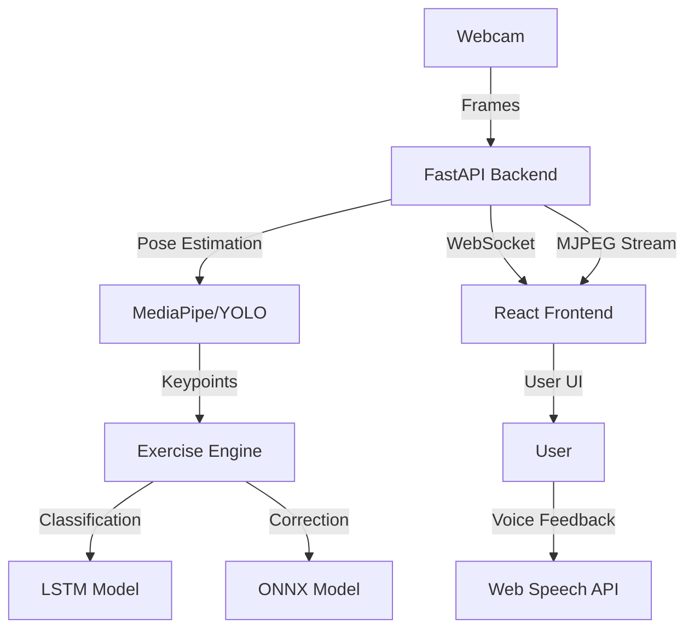

# System Architecture: Virtual Sports Coach

The project follows a modern **Client-Server** architecture designed for real-time performance and modularity.

## 1. High-Level Overview

## 2. Component Roles

### Backend (Python/FastAPI)
- **Capture**: Continuously grabs frames from the camera using OpenCV.
- **Worker Thread**: Processes frames in a separate thread to maintain a high FPS for the video stream.
- **Pose Detection**: Uses MediaPipe Tasks API (primary) or YOLOv11 (alternative) to extract body landmarks.
- **Hardware Manager**: Abstracts interactions with physical components (LEDs, Buzzer, Servo) and provides a simulator for dev testing.

### Frontend (React/Next.js)
- **Real-time Display**: Shows the processed video feed from the backend.
- **State Management**: Tracks current reps, sets, and exercise state received via WebSocket.
- **Audio Feedback**: Triggers voice cues based on validation results (e.g., "Full extension!", "Go lower!").

### Exercise Engine
- **Logic**: Validates each repetition based on joint angles (e.g., knee angle for squats).
- **ML Inference**: Uses pre-trained models to identify exercises and detect common form errors.

## 3. Physical Layout
When deployed on a Raspberry Pi:
- The Pi acts as the processing hub.
- It controls a **Servo Motor** to keep the user centered in the frame.
- It provides physical feedback via **LEDs** and a **Buzzer**.

---
**Author:** Moussaif Abdelkabir
**Date:** Feb 15, 2026
